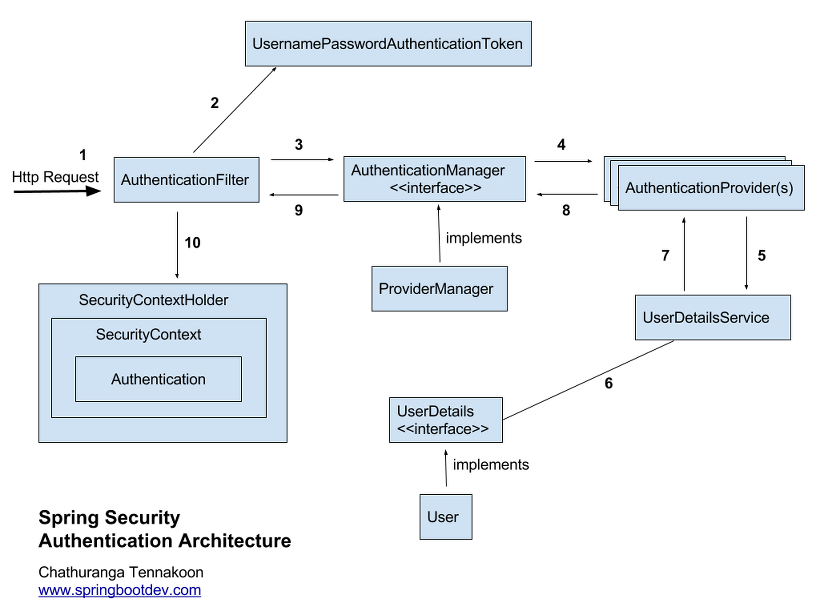
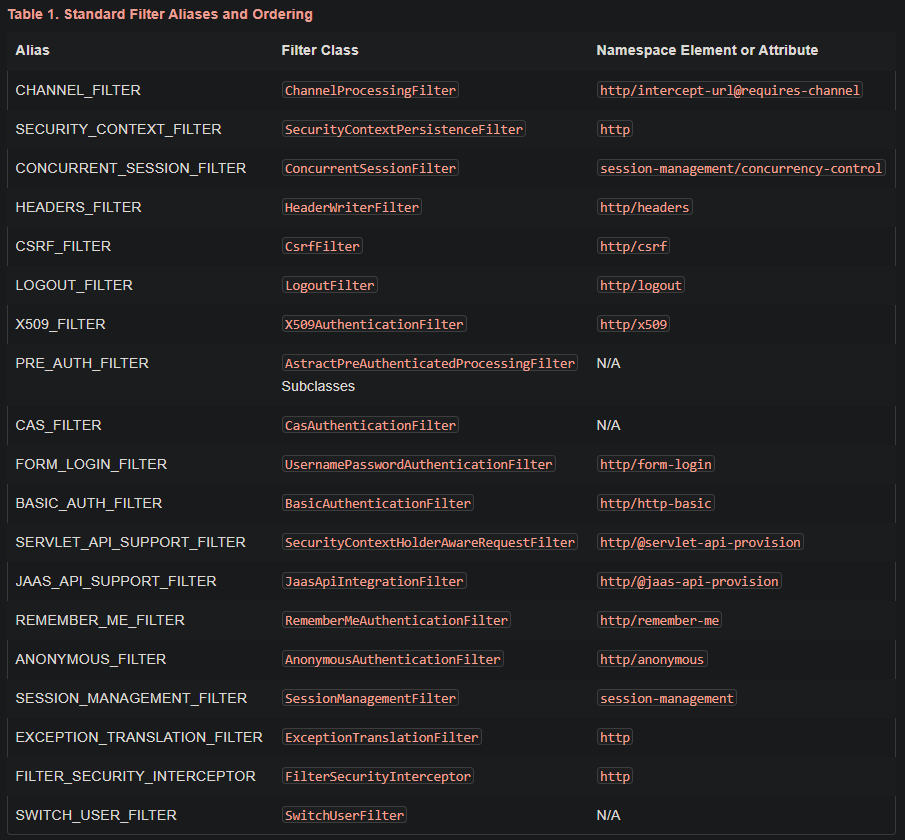

## GOAL
rest api 기반의 ajax를 쓰는 프로젝트에서 jwt 토큰을 사용하여 spring security 구현

**세부목표**
1. jwt 토큰을 사용한 로그인
2. 일반회원과 매니저가 나뉘도록 권한 설정
3. 메뉴별 권한 다르게 설정

## 목차
1. java configuration
2. spring security configuration
3. spring security - 인증,인가,인증방식
4. **spring security - 내부 인증 과정**
5. spring security - csrf
6. spring security - jwt toekn

><strong>프로젝트 환경</strong>
>framework version : spring 5.2.7
>jdk : java 1.8
>ide : intellij
>was : tomcat 8.5
>build : maven

### [3] 인증 과정

다음은 스프링 시큐리티의 인증이 완료되는 과정을 나타낸 그림이다.

정말 간략하게 말한다면
1) 사용자로부터 받은 리퀘스트를 <code>Authentication Filter</code> (List) 를 거쳐 인증을 완료한 후(1~9)
2) 생성된 <code>Authentication</code> 객체를 <code>SecurityContext</code>에 저장하는 것이다.(10)

✨ 사용자는 <code>SecurityContext</code>에 저장된 인증정보를 필요할 때마다 꺼내어 사용할 수 있다.

<code> **[1] AuthenticationFilter</code>가 어떤 순서로 동작하는지 더 자세하게 파고들어보자.**
클라이언트로 부터 온 <code>Request</code>는 먼저 <code>ApplicationFilter</code>를 돈 후 <code>springSecurityFilterChain</code>을 거치게 된다.

<code>springSecurityFilterChain</code>은 **'스프링 시큐리티의 Filter 리스트'**를 가지고 있는 객체이다.

원래 스프링 프레임워크가 가지고 있는 필터가 아니기 때문에 사용하려면 <code>DelegatingFilterProxy</code> 클래스를 <code>springSecurityFilterChain</code>라는 이름의 Bean으로 등록을 시켜주어야 한다.

필터라는 것은 무언가를 거른다는 뜻이다. 스프링 시큐리티 필터 체인은 사용자의 리퀘스트를 가지고 **순서대로** 필터 리스트를 돈다.
필터 중 하나에 인증이 되었다면 인증이 완료된 것이고, 마지막까지 인증이 되지 않았다면 인증 실패라고 여긴다. 따라서 필터의 순서를
아는 것도 중요하다.

    
더보기 - Spring Security Standard Filter Aliases And Ordering 

    
더보기 - [표] 주요 스프링 시큐리티 필터의 용도에 대한 간략한 설명

| **필터 이름**                         | **하는 일**                              |
|---------------------------------|------------------------------------|
|SecurityContextPersistenceFilter | SecurityContext 가 없으면 만들어주는 필터 |
|HeaderWriterFilter               | 응답(Response)에 Security와 관련된 헤더 값을 설정해주는 필터 |
|CsrfFilter | CSRF 공격을 방어하는 필터 |
|LogoutFilter| 로그아웃 요청을 처리하는 필터 |
|BasicAuthenticationFilter | HttpBasic Authentication을  처리하는 필터 |
|UserNamePasswordAuthenticationFilter | form-based Authentication을 처리하는 필터 |
|RequestCacheAwareFilter | 인증 후 원래 Request 정보로 재구성하는 필터 |
|AnonymousAuthenticationFilter | 이 필터에 올 때까지 사용자 정보가 인증되지 않았다면 이 요청은 익명의 사용자가 보낸 것으로 판단함(Authentication 객체를 새로 생성)  |
|SessionManagementFilter | 세션 변조 공격 방지, 유효하지 않은 세션으로 접근했을 때 URL 핸들링, 세션 생성 전략 설정, 최대 세션 수 설정 |
|ExceptionTranslationFilter | 앞 선 필터에서 예외가 발생할 경우 캐치하여 처리하는 필터 |
|FilterSecurityInterceptor | 인가(Authorization)를 결정하는 AccessDecisionManager에게 접근 권한이 있는지 확인하고 처리하는 필터 |

>**springSecurityFilterChain** : 스프링 시큐리티 필터 리스트를 가지고 있는 객체로 필터 리스트를 순회하며 필터링을 실시.

