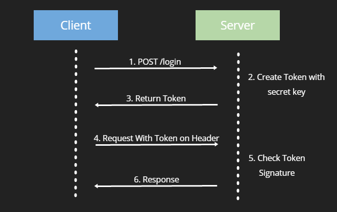
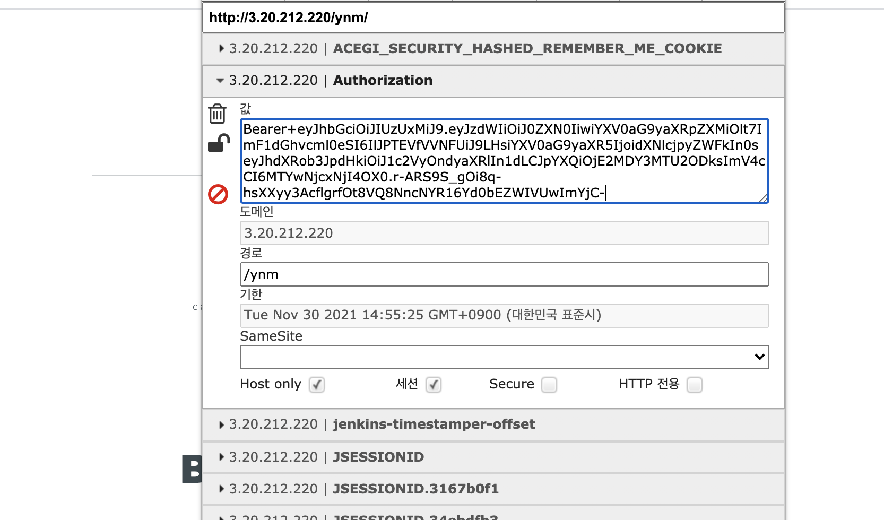

# Summary

지난 포스팅에서는 form based 인증이 어떤 과정으로 이뤄지는지 알아봤다.
그런데 내가 구축하고 싶은 것은 TOKEN을 기반으로 한 인증 시스템이다. ✊
이 포스팅에서는 JWT TOKEN에 관하여 간략히 설명하고 실제 프로젝트에 적용한 예제를 설명한다.

왜 TOKEN으로 인증하는 시스템을 만들어야 할까? 다음과 같은 이유들이 있다.

# 장점
- Fast
- Stateless(무상태성) : 데이터베이스나 세션이 필요없다. 유저가 로그인을 하기 위한 모든 정보는 토큰에 있다.
- 여러 서비스에서 접근이 가능하다. : 웹앱, IOS, Android 등 서비스마다 다른 인증 방식을 사용하는데, 토큰 인증 방식은 어느 서비스나 사용이 가능하다.

# 단점
- 비밀키(토큰을 만들때 쓰이는 키)가 손상될 수 있음.
- 로그인 한 사용자 표시되지 않음 : 사용자가 로그인했는지, 로그아웃했는지 이력을 남길 수 없음.
- 토큰이 탈취될 수 있음.


# JWT TOKEN 인증 방식



- 클라이언트에서 서버에게 credentials를 보낸다.
- 서버는 credentials를 validate하고 인증 완료시 signs token을 생성한다.
- 생성한 토큰을 클라이언트로 보낸다.
- 클라이언트는 토큰을 쿠키 혹은 로컬저장소 등에 보관하고 있다가 모든 리퀘스트와 함께 보낸다.
- 받은 토큰을 필터에서 verity한다.


# 토이 프로젝트 적용 예제

토이 프로젝트는 데이터 전송 시 ajax를 사용한다. 프론트 단에서 다음과 같은 자바스크립트 함수를 만들었다.
username과 password가 필드로 포함된 폼데이터를 JSON 오브젝트로 만들어 서버에 넘긴다.

```html
<form class="form-signin" method="post" id="myForm">
  <p>
    <label for="username" class="sr-only">Username</label>
    <input type="text" id="username" name="username" class="form-control" placeholder="Usernameeeee" required="" autofocus="">
  </p>
  <p>
    <label for="password" class="sr-only">Password</label>
    <input type="password" id="password" name="password" class="form-control" placeholder="Passworddddd" required="">
  </p>
  .......
</form>
```
```javascript
var data = $("#myForm").serializeObject();
$.ajax({
  type : "POST",
  url : "${contextPath}/login",
  contentType : "application/json",
  data : JSON.stringify(data),
  async: true,
  cache :false, // 캐시 여부
  success : function(result, response){
    alert("정상적으로 로그인되었습니다.");
  },
  error   : function(result, textStatus, jqXHR){
    alert("error");
  }
});
```
```java
public UsernamePasswordAuthenticationFilter() {
    super(new AntPathRequestMatcher("/login", "POST"));
}
```

화면의 로그인 버튼을 누르면 사용자가 입력한 유저네임과 패스워드는 JSON 형태로 Http Request에 실려 서버로 날아간다.
이 요청은 디스패쳐 서블릿에 닿기 전에 먼저 UsernamePasswordAuthenticationFilter에 걸리게 된다.

정확히는, JWT TOKEN을 생성하기 위하여 UsernamePasswordAuthenticationFilter를 상속받아 만든 새로운 필터이다.
UsernamePasswordAuthenticationFilter를 상속받으면 attemptAuthentication 메서드와 successfulAuthentication를 재정의할수있다.

이름에서 직관적으로 알 수 있듯, attemptAuthentication로 인증을 시도한 후 성공할 시 successfulAuthentication로 가서 성공 후처리 작업을 한다.
만일 인증을 실패할 시 RuntimeException을 발생시킨다.(AuthenticationException가 RuntimeException를 상속받아 만들어진 클래스이기 때문)

자세하게 알아보면 attemptAuthentication에서는
- 사용자가 입력한 JSON 형태의 데이터(유저네임, 패스워드)를 JwtAuthenticationRequest에 담는다
- JwtAuthenticationRequest에서 가져온 데이터로 Authentication 객체를 생성한다
- 생성한 Authentication 객체를 authenticationManager의 인자로 넘겨 인증을 진행한다.
과 같은 과정을 거친다.

인증이 성공할 경우(Authentication가 정상적으로 return 될 경우), successfulAuthentication가 실행된다.
이 메서드에서는 앞으로 인증에 쓰일 JWT TOKEN을 만들어 쿠키에 넣어주면 된다.
(로컬 스토리지 등 다른 옵션이 있지만 나는 쿠키를 선택하였다.)

예제 코드를 따라가며 설명을 보자.

```java
public class JwtAuthenticationFilter extends UsernamePasswordAuthenticationFilter  {

    private final AuthenticationManager authenticationManager;
    private final SecretKey secretKey;

    public JwtAuthenticationFilter(AuthenticationManager authenticationManager,
                                   SecretKey secretKey) {
        this.authenticationManager = authenticationManager;
        this.secretKey = secretKey;
    }

    /* 인증 시도하는 메소드 */
    @Override
    public Authentication attemptAuthentication(HttpServletRequest request,
                                                HttpServletResponse response) throws AuthenticationException {


      try {
            /* 1. 사용자가 입력한 JSON 오브젝트를 읽어들인다. */
            BufferedReader reader = request.getReader();
            String line = reader.readLine();

            /* 2. ObjectMapper를 이용하여 JSON 데이터를 파싱하여 JwtAuthenticationRequest에 값을 넣는다.  */
            JwtAuthenticationRequest jwtAuthenticationRequest = new ObjectMapper()
                    .readValue(line, JwtAuthenticationRequest.class);

            /* 3. null 처리를 해준다. */
            if (StringUtils.isNullOrEmpty(jwtAuthenticationRequest.getUsername()) ||
                    StringUtils.isNullOrEmpty(jwtAuthenticationRequest.getPassword())) {
                throw new AuthenticationServiceException("Username or Password not provided");
            }

            /* 4. UsernamePasswordAuthenticationToken(Authentication 인터페이스의 구현체)를 이용하여 Authentication 인증 객체를 생성한다.
             사용자가 입력한 유저네임과 패스워드를 이용한다. */
            Authentication authentication = new UsernamePasswordAuthenticationToken(
                    jwtAuthenticationRequest.getUsername(),
                    jwtAuthenticationRequest.getPassword()
            );

            /* 5. authenticationManager에서 인증하도록 인증 객체를 전달한다.(전 편 인증 과정 참조) */
            Authentication authenticate = authenticationManager.authenticate(authentication);
            return authenticate;

        } catch (IOException e) {
            throw new RuntimeException(e);
        }

    }

    /* 인증 성공 후 진입하는 메소드 */
    @Override
    protected void successfulAuthentication(HttpServletRequest request,
                                            HttpServletResponse response,
                                            FilterChain chain,
                                            Authentication authResult) throws IOException, ServletException {

        /* 인증을 성공했으니 이제 사용할 토큰을 만들자. 인증 객체에서 가져온 유저네임, 유저가 가지고 있는 권한 등을 이용해 토큰을 만든다.
        만든 날짜와 토큰이 만료될 날짜도 정해준다. 보통 액세스 토큰은 날짜를 짧게 설정한다.
        그리고 비밀키로 sign 해준다.
        */
        String accessToken = Jwts.builder()
                .setSubject(authResult.getName())
                .claim("authorities", authResult.getAuthorities())
                .setIssuedAt(new java.util.Date())
                .setExpiration(new Date(System.currentTimeMillis() + 600000))
                .signWith(secretKey)
                .compact();


        /* 쿠키에 "Authorization" 이라는 이름으로 토큰을 저장한다. Bearer 인증 방식을 사용하여 토큰 앞에 "Bearer "을 붙여야 한.  */
        Cookie cookie = new Cookie(
                HttpHeaders.AUTHORIZATION,
                URLEncoder.encode("Bearer ", "UTF-8")+accessToken);

        /* 보안을 위하여 httponly 설정을 해줌 */
        cookie.setHttpOnly(true);

        //쿠키에 액세스토큰을 저장한다.
        response.addCookie(cookie);
    }

}
```

이제 사용자의 리퀘스트마다 인증을 담당해줄 액세스 토큰이 만들어졌다. 그런데 커스텀 필터이므로 설정 파일에서 등록해주어야 한다.
스프링 시큐리티 설정 파일인 AppSecurityConfig를 보자. configure 메소드에 addFilter로 JwtAuthenticationFilter를 추가해주면 된다.

```java
public class AppSecurityConfig extends WebSecurityConfigurerAdapter {
    @Override
    protected void configure(HttpSecurity http) throws Exception {

        http
                .csrf().disable()
                //.csrf()
                //    .csrfTokenRepository(CookieCsrfTokenRepository.withHttpOnlyFalse())
                //    .and()
                .httpBasic().disable()
                .formLogin().disable()
                .sessionManagement()
                    .sessionCreationPolicy(SessionCreationPolicy.STATELESS)
                .and()
                .addFilter(new JwtAuthenticationFilter(authenticationManager(), secretKey))
                .addFilterAfter(new JwtTokenVerifier(secretKey), JwtAuthenticationFilter.class)
                .exceptionHandling()
                .accessDeniedHandler(customAccessDeniedHandler())
                .and()
                .authorizeRequests()
                .antMatchers("/", "/login", "/resources/**/**").permitAll()
                .anyRequest()
                .authenticated();
                //.permitAll();

    }
}
```

addFilter 밑에 보면 addFilterAfter 함수가 있다. 말 그대로 어떤 필터 다음에 실행될 필터를 추가하는 것이다.
방금 만든 JwtAuthenticationFilter 다음에 JwtTokenVerifier 필터를 추가하였다.
이 필터는 이름에서 알 수 있듯 JWT TOKEN을 검증하는 필터이다.

이 필터가 하는 일은 사용자의 리퀘스트에 포함된 JWT TOKEN을 파싱하여 유저네임, 유저권한, 토큰 만료일 등을 확인하고
합당한 요청이면 다시 인증 객체를 만드는 것이다.

왜 굳이 다시 인증 객체를 만드냐면, password같은 민감한 정보를 빼고 인증 객체를 만들어야 하기 때문이다.

토큰 검증 필터는 OncePerRequestFilter를 상속받아 만든다. OncePerRequestFilter는 같은 리퀘스트에 대해서는 단 한번의 처리가 수행되는 것을 보장하는 클래스이다.

```java
public class JwtTokenVerifier extends OncePerRequestFilter {

    //토큰 생성시 비밀키 가져오는 클래스
    private final SecretKey secretKey;

    public JwtTokenVerifier(SecretKey secretKey) {
        this.secretKey = secretKey;
    }

    @Override
    protected void doFilterInternal(HttpServletRequest request,
                                    HttpServletResponse response,
                                    FilterChain filterChain) throws ServletException, IOException {

        String requestHeader = "";
        Cookie[] requestCookies = request.getCookies();

        if (requestCookies != null) {
            //쿠키에서 암호화된 헤더를 찾음("Authorizaion" 이라는 이름으로 된 쿠키를 찾음)
            for (Cookie requestCookie : requestCookies) {
                if (HttpHeaders.AUTHORIZATION.equals(requestCookie.getName())) {
                    requestHeader = requestCookie.getValue();
                    break;
                }
            }

            //null 처리를 한다. or 혹은 'Bearer '로 시작하는 토큰을 찾지 못하면 요청을 넘김
            if (Strings.isNullOrEmpty(requestHeader) || !requestHeader.startsWith(URLEncoder.encode("Bearer ", "UTF-8"))) {
                filterChain.doFilter(request, response);
                return;
            }

            //액세스토큰(JwtAuthenticationFilter 클래스에서 만든 토큰)을 변수에 담는다.
            String accessToken = requestHeader.replace(URLEncoder.encode("Bearer ", "UTF-8"), " ");

            try {

                //Jws 라이브러리를 이용하여 변수에 담은 jwt 토큰을 파싱해준다.
                Jws<Claims> claimsJws = Jwts.parser()
                    .setSigningKey(secretKey)
                    .parseClaimsJws(accessToken);

                //유저네임, 권한 등을 변수에 담아 새로운 인증 객체를 생성한다. 이때, 비밀번호 같은 민감한 정보는 넣지 않는다.
                Claims body = claimsJws.getBody();

                String username = body.getSubject();

                List<Map<String, String>> authorities = (List<Map<String, String>>) body.get("authorities");

                Set<SimpleGrantedAuthority> simpleGrantedAuthorities = authorities.stream()
                        .map(m -> new SimpleGrantedAuthority(m.get("authority")))
                        .collect(Collectors.toSet());

                Authentication authentication = new UsernamePasswordAuthenticationToken(
                        username,
                        null,
                        simpleGrantedAuthorities
                );

                //민감한 정보를 빼고 만든 인증 객체를 SecurityContextHolder에 넣는다.
                SecurityContextHolder.getContext().setAuthentication(authentication);

            }catch(JwtException e) {
                throw new IllegalStateException(String.format("Token %s cannot be trust", accessToken));
            }
            //filter1에서 filter2로 넘겨줘야함
            filterChain.doFilter(request, response);
        }

    }

}
```

이제 모든 작업이 완료되었다. 로그인을 해보면 정상적으로 쿠키에 Authorization이라는 이름으로 토큰이 들어가 있을 것이다 😝





